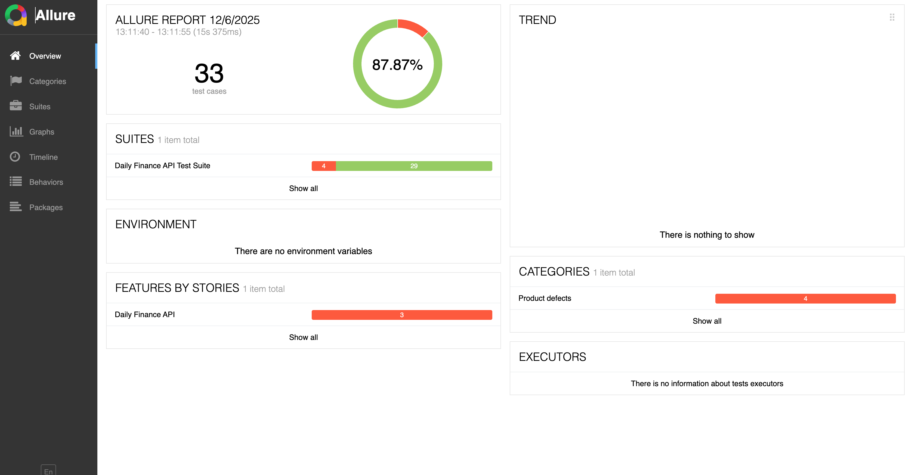
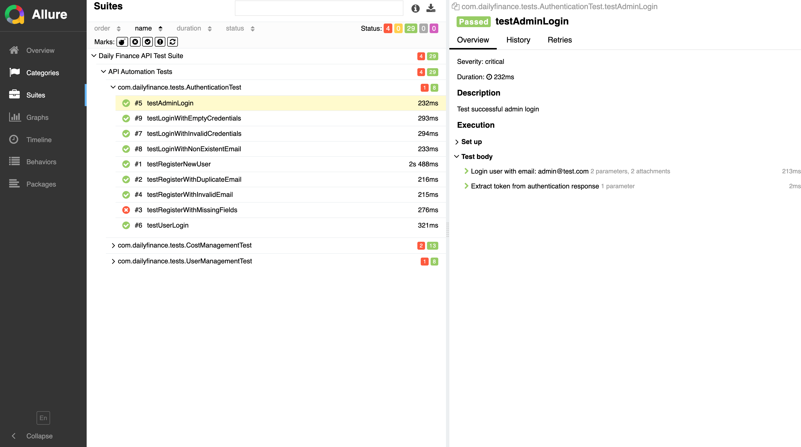
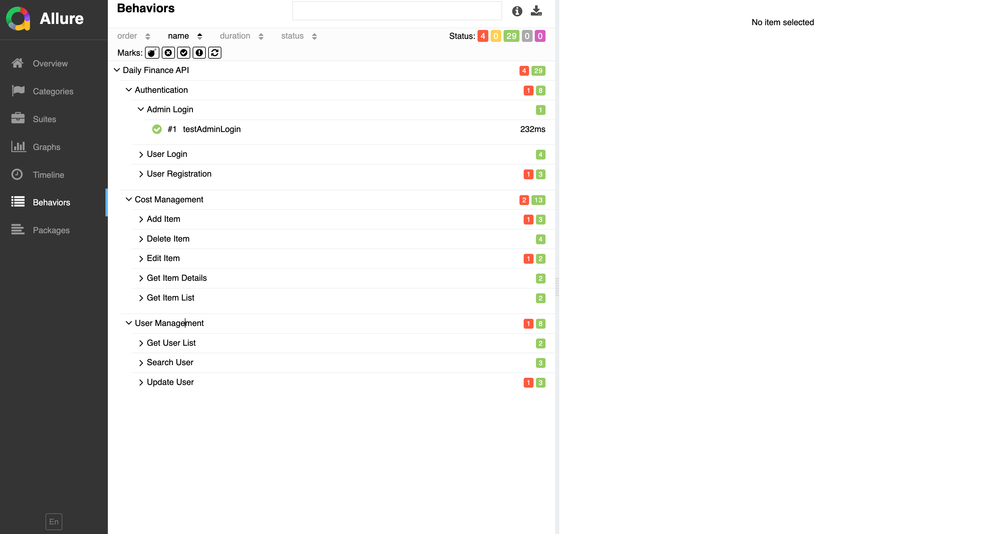

# Daily Finance API Automation Project

[](https://www.oracle.com/java/)
[](https://rest-assured.io/)
[](https://testng.org/)
[](https://docs.qameta.io/allure/)

## 📋 Project Overview

This project is a comprehensive API automation framework for the Daily Finance application using Rest Assured with Page Object Model (POM) architecture. The framework includes positive and negative test scenarios with detailed Allure reporting.

### Application Under Test
**URL:** https://dailyfinance.roadtocareer.net/  
**API Base URL:** https://dailyfinanceapi.roadtocareer.net/api

---

## 🎯 Features Automated

The automation covers the following API endpoints and features:

### Authentication Module
- ✅ Register a new user
- ✅ Login by admin (email: admin@test.com, password: admin123)
- ✅ Login by regular user

### User Management Module
- ✅ Get user list
- ✅ Search user by user ID
- ✅ Edit user information (firstname, phone number)

### Cost Management Module
- ✅ Get item/cost list
- ✅ Add new item/cost
- ✅ Edit item name and details
- ✅ Delete item from the list

---

## 🏗️ Project Architecture

The project follows **Page Object Model (POM)** architecture with the following structure:

```
test-assured/
│
├── src/test/java/com/dailyfinance/
│   ├── base/
│   │   └── BaseTest.java                 # Base test setup and common methods
│   │
│   ├── endpoints/                        # API endpoint classes (POM)
│   │   ├── AuthEndpoints.java           # Authentication endpoints
│   │   ├── UserEndpoints.java           # User management endpoints
│   │   └── CostEndpoints.java           # Cost management endpoints
│   │
│   ├── models/                           # POJO classes
│   │   ├── User.java
│   │   ├── RegisterRequest.java
│   │   ├── LoginRequest.java
│   │   ├── AuthResponse.java
│   │   ├── Cost.java
│   │   └── CostRequest.java
│   │
│   ├── tests/                            # Test classes
│   │   ├── AuthenticationTest.java      # Authentication test scenarios
│   │   ├── UserManagementTest.java      # User management test scenarios
│   │   └── CostManagementTest.java      # Cost management test scenarios
│   │
│   └── utils/                            # Utility classes
│       ├── ConfigReader.java            # Configuration properties reader
│       └── TestDataGenerator.java       # Test data generation utility
│
├── src/test/resources/
│   ├── config.properties                 # Configuration file
│   └── allure.properties                 # Allure configuration
│
├── testng.xml                            # TestNG suite configuration
├── pom.xml                               # Maven dependencies
└── README.md                             # Project documentation
```

---

## 🧪 Test Coverage

### Total Test Cases: 33

#### Authentication Tests (9 tests)
- ✅ Successful user registration
- ✅ Registration with duplicate email (Negative)
- ✅ Registration with missing fields (Negative)
- ✅ Registration with invalid email format (Negative)
- ✅ Successful admin login
- ✅ Successful user login
- ✅ Login with invalid credentials (Negative)
- ✅ Login with non-existent email (Negative)
- ✅ Login with empty credentials (Negative)

#### User Management Tests (9 tests)
- ✅ Get all users
- ✅ Get users without authentication (Negative)
- ✅ Search user by ID
- ✅ Search user with invalid ID (Negative)
- ✅ Search user without authentication (Negative)
- ✅ Update user information
- ✅ Update user with invalid ID (Negative)
- ✅ Update user without authentication (Negative)
- ✅ Update user with user token (Authorization test)

#### Cost Management Tests (15 tests)
- ✅ Get all cost items
- ✅ Get costs without authentication (Negative)
- ✅ Add new cost item
- ✅ Add cost without authentication (Negative)
- ✅ Add cost with missing fields (Negative)
- ✅ Add cost with invalid quantity (Negative)
- ✅ Get cost by ID
- ✅ Get cost with invalid ID (Negative)
- ✅ Update cost item name
- ✅ Update cost without authentication (Negative)
- ✅ Update cost with invalid ID (Negative)
- ✅ Delete cost item
- ✅ Delete already deleted cost (Negative)
- ✅ Delete cost without authentication (Negative)
- ✅ Delete cost with invalid ID (Negative)

---

## 🔧 Technology Stack

| Technology | Version | Purpose |
|-----------|---------|---------|
| Java | 11 | Programming Language |
| Maven | 3.x | Build & Dependency Management |
| Rest Assured | 5.3.2 | API Testing Framework |
| TestNG | 7.8.0 | Test Execution Framework |
| Allure | 2.24.0 | Test Reporting |
| Jackson | 2.15.3 | JSON Serialization/Deserialization |
| Lombok | 1.18.30 | Reduce Boilerplate Code |
| JavaFaker | 1.0.2 | Test Data Generation |

---

## 📦 Prerequisites

Before running the tests, ensure you have the following installed:

- **Java JDK 11** or higher
- **Maven 3.6+**
- **Allure Command Line** (for generating reports)

### Installing Allure

**macOS:**
```bash
brew install allure
```

**Windows:**
```bash
scoop install allure
```

**Linux:**
```bash
sudo apt-add-repository ppa:qameta/allure
sudo apt-get update
sudo apt-get install allure
```

---

## 🚀 Running the Tests

### 1. Clone the Repository
```bash
git clone <your-repository-url>
cd test-assured
```

### 2. Install Dependencies
```bash
mvn clean install -DskipTests
```

### 3. Run All Tests
```bash
mvn clean test
```

### 4. Run Specific Test Class
```bash
mvn test -Dtest=AuthenticationTest
mvn test -Dtest=UserManagementTest
mvn test -Dtest=CostManagementTest
```

### 5. Run Tests with TestNG XML
```bash
mvn test -DsuiteXmlFile=testng.xml
```

---

## 📊 Generating Allure Reports

### Generate and Open Report
```bash
mvn clean test
allure serve target/allure-results
```

### Generate Report to Specific Directory
```bash
allure generate target/allure-results --clean -o allure-report
allure open allure-report
```

---

## 📸 Allure Report Screenshot


*Allure Test Report Overview showing test execution summary*


*Detailed view of test suites and test cases*


*Test cases organized by features and stories*

---

## 📝 Postman Collection

### Documentation Link
**Postman Collection Documentation:** [Daily Finance API Collection](https://jannatulferdous-1982702.postman.co/workspace/Jannatul-Ferdous's-Workspace~b5fcf4c2-117e-4ddb-843d-4b80352fdff6/collection/46796575-d508a59f-7d6f-4425-a2e6-c875e9358e02?action=share&creator=46796575)

### Import Collection
You can import the Postman collection from the `postman/` directory:
- `Daily_Finance_API.postman_collection.json`

---

## 📋 Test Case Documentation

### Test Case Link
**Test Cases Spreadsheet:** [Daily Finance Test Cases](https://docs.google.com/spreadsheets/d/1J2bis_4wqxnCCnKOAZJnPyifPKCaYmM8pBwf3cYUHvk/edit?usp=sharing)

### Test Case Format
Each test case includes:
- Test Case ID
- Test Scenario
- Test Steps
- Expected Result
- Actual Result
- Status (Pass/Fail)
- Priority (Critical/High/Medium/Low)

---

## ⚙️ Configuration

### config.properties
Update `src/test/resources/config.properties` to modify API endpoints or credentials:

```properties
base.uri=https://dailyfinanceapi.roadtocareer.net
base.path=/api
admin.email=admin@test.com
admin.password=admin123
```

### testng.xml
Modify `testng.xml` to configure test execution order and parallelization:

```xml
<suite name="Daily Finance API Test Suite" verbose="1">
    <test name="API Automation Tests" preserve-order="true">
        <classes>
            <class name="com.dailyfinance.tests.AuthenticationTest"/>
            <class name="com.dailyfinance.tests.UserManagementTest"/>
            <class name="com.dailyfinance.tests.CostManagementTest"/>
        </classes>
    </test>
</suite>
```

---

## 🎯 Key Features

### 1. **POM Architecture**
- Separation of concerns with dedicated endpoint classes
- Reusable methods for API calls
- Easy maintenance and scalability

### 2. **Comprehensive Test Coverage**
- Positive test scenarios
- Negative test scenarios (error handling)
- Boundary value testing
- Authorization and authentication testing

### 3. **Allure Integration**
- Step-by-step execution details
- Request/Response logging
- Categorization by Epic, Feature, Story
- Severity levels for test cases
- Detailed failure screenshots and logs

### 4. **Dynamic Test Data**
- JavaFaker for realistic test data
- Unique email generation to avoid conflicts
- Random data generation for phone numbers, addresses, etc.

### 5. **Logging**
- Detailed request/response logging
- Rest Assured logging integration
- Allure report integration for better debugging

---

## 🐛 Troubleshooting

### Common Issues

**Issue 1: Tests fail with "Connection refused"**
```
Solution: Verify the API base URL in config.properties and ensure the server is running.
```

**Issue 2: Allure command not found**
```
Solution: Install Allure using the commands provided in Prerequisites section.
```

**Issue 3: Maven dependencies not downloading**
```
Solution: Run 'mvn clean install -U' to force update dependencies.
```

**Issue 4: Java version mismatch**
```
Solution: Ensure Java 11+ is installed and JAVA_HOME is set correctly.
```

---

## 🙏 Acknowledgments

- Daily Finance Application Team
- Rest Assured Documentation
- Allure Framework Documentation
- Road To Career Training Platform

---

## 📚 Additional Resources

- [Rest Assured Documentation](https://rest-assured.io/)
- [TestNG Documentation](https://testng.org/doc/)
- [Allure Report Documentation](https://docs.qameta.io/allure/)
- [Maven Documentation](https://maven.apache.org/guides/)

---

**Last Updated:** December 2025  
**Version:** 1.0.0
